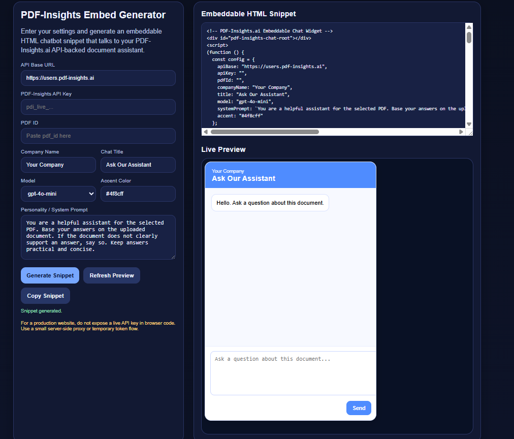
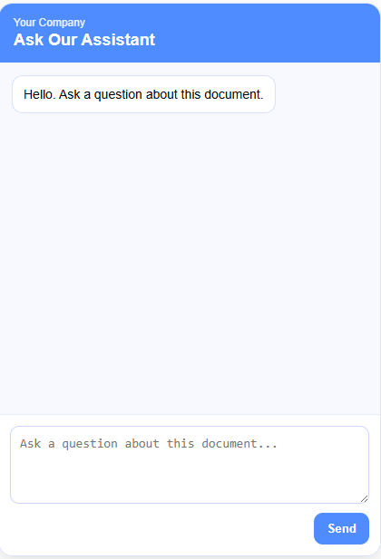

# Build an AI Chatbot from Any PDF

⚡ Build and deploy a PDF-powered chatbot in under 5 minutes.

Create a working HTML chatbot for any PDF using the PDF-Insights.ai API.

This example is designed for developers, agencies, and AI builders who want to turn a PDF into an embeddable chatbot quickly.

It includes:

- an HTML chatbot generator
- a simple setup flow
- a production note showing how to hide the API key with a server-side proxy

---

## What This Does

This example lets you:

1. upload a PDF to PDF-Insights.ai
2. get a `pdf_id`
3. enter your API key, `pdf_id`, company name, title, model, and personality
4. generate an embeddable HTML chatbot snippet
5. paste the snippet into a website or standalone page

Typical use cases:

- product catalogs
- technical manuals
- training documents
- procedures / SOPs
- internal knowledge bases
- customer support widgets

---

## Fast Path Overview

The simplest path is:

1. create a PDF-Insights.ai account
2. create an API key
3. run a Python script to upload your PDF and return a `pdf_id`
4. open the HTML chatbot generator
5. paste in your API key and `pdf_id`
6. generate the chatbot snippet
7. embed it in a webpage

---

## Step 1 — Create a PDF-Insights.ai Account

Go to:

https://users.pdf-insights.ai/ui/

Register and log in.

Every account includes free trial credit, so you can test the API before spending anything.

---


## Step 2 — Create an API Key

After logging in:

1. Click **Advanced**
2. Scroll to the bottom
3. Open **Developer API**
4. Click **Create API Key**

Your key will look like:


pdi_live_xxxxxxxxxxxxxxxxxxxxxxxxx

Save it somewhere safe.

## Step 3 — Upload Your PDF and Get pdf_id

Use the Python script below to:

upload your document
return the pdf_id
test one chat request
Install requirement
pip install requests
Example script

Save this as upload_and_test_pdf.py:
```markdown

import requests
import uuid
import time

API_KEY = "pdi_live_your_key_here"
BASE_URL = "https://users.pdf-insights.ai"

headers = {
    "Authorization": f"Bearer {API_KEY}"
}

# -------------------------------
# 1. Upload PDF
# -------------------------------
with open("example.pdf", "rb") as f:
    upload_resp = requests.post(
        f"{BASE_URL}/pdf/upload",
        headers=headers,
        files={"file": ("example.pdf", f, "application/pdf")}
    )

upload_resp.raise_for_status()
upload_data = upload_resp.json()

pdf_id = upload_data["pdf_id"]
print("Uploaded PDF ID:", pdf_id)

# Optional: brief wait for processing
time.sleep(3)

# -------------------------------
# 2. Send chat request
# -------------------------------
chat_headers = {
    "Authorization": f"Bearer {API_KEY}",
    "Content-Type": "application/json"
}

payload = {
    "session_id": str(uuid.uuid4()),
    "pdf_id": pdf_id,
    "message": "Summarize this document",
    "model": "gpt-4o-mini",
    "system_prompt": "You are a helpful assistant. Base your answer only on the uploaded document."
}

chat_resp = requests.post(
    f"{BASE_URL}/chat",
    headers=chat_headers,
    json=payload
)

chat_resp.raise_for_status()
chat_data = chat_resp.json()

print("\nChat response:")
print(chat_data.get("answer", chat_data))

```

Using your own PDF

Place your PDF in the same folder as the script and rename it:

example.pdf

Or change these lines:

```markdown
with open("example.pdf", "rb") as f:
```
Example:
```markdown
with open("my_catalog.pdf", "rb") as f:
```
and

```markdown
files={"file": ("my_catalog.pdf", f, "application/pdf")}
```
for a file named my_catalog.pdf

Run it

```markdown
python upload_and_test_pdf.py
```
The script will print your pdf_id.

## Step 4 — Open the HTML Chatbot Generator

Open:
```markdown
pdf_insights_embed_generator.html
```



*Example: Generator interface ready for input*


## Step 5 — Enter Your Settings

API Key
PDF ID
Company Name
Chat Title
Model
System Prompt

Click Generate Snippet

## Step 6 — Copy the HTML Snippet

Paste into your website or HTML page.




*Chat Engine Embedded in your website*
